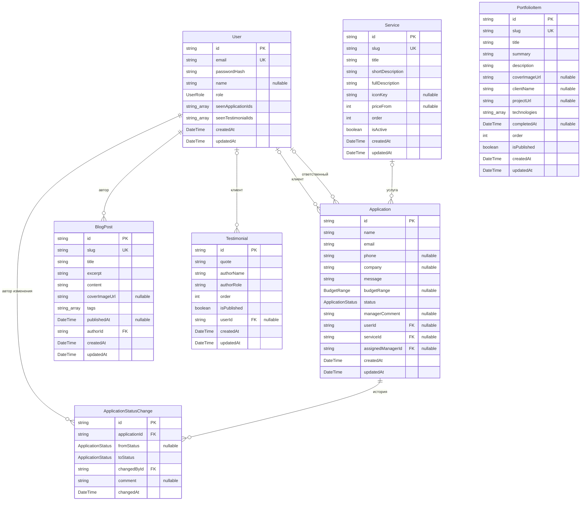

# ER-диаграмма базы данных

Источник истины — `prisma/schema.prisma`. Диаграмма в формате Mermaid отображается на GitHub автоматически.

## Состав сущностей

| Сущность | Назначение |
|---|---|
| **User** | Пользователь системы (клиент или администратор). Уникальный email, хеш пароля, имя, роль, отметки о просмотренных администратором заявках и отзывах. |
| **Service** | Услуга в каталоге. Уникальный slug, заголовок, краткое и полное описание (с англоязычными парами), пиктограмма, опциональная цена «от X», порядок отображения, признак активности. |
| **Application** | Клиентская заявка. Может быть отправлена из личного кабинета (`userId`) или существовать без привязки к учётной записи; привязка к услуге и назначенному сотруднику опциональна. Поле `status` — текущий статус, `statusHistory` — полная история смены. |
| **ApplicationStatusChange** | Запись истории смены статуса заявки. Фиксирует исходный и новый статусы, автора изменения, комментарий и момент времени. |
| **PortfolioItem** | Кейс портфолио. Описание реализованного проекта, технологии, заказчик, ссылка на проект (опционально). |
| **BlogPost** | Публикация блога. Markdown-контент, теги, дата публикации (null = черновик), автор. |
| **Testimonial** | Отзыв клиента. Текст, имя и должность автора, опциональная связь с учётной записью клиента, признак публикации, порядок вывода в карусели. |

> Локализуемые поля контентных сущностей (Service, PortfolioItem, BlogPost, Testimonial) хранятся парами «основное + англоязычное (`*En`)»; в диаграмме показано только базовое поле во избежание загромождения.

## Перечисления

- **UserRole** — `CLIENT`, `MANAGER`, `ADMIN` (значение `MANAGER` зарезервировано и в текущей версии не используется).
- **ApplicationStatus** — `NEW`, `IN_PROGRESS`, `DONE`, `REJECTED`.
- **BudgetRange** — `UNDER_100K`, `FROM_100K_TO_500K`, `FROM_500K_TO_1M`, `OVER_1M`.

## Связи

| Связь | Кратность | Поведение при удалении |
|---|---|---|
| `User` → `Application` (клиент) | 0..1 : N | `SET NULL` (заявка остаётся как анонимная) |
| `User` → `Application` (ответственный) | 0..1 : N | `SET NULL` (заявка остаётся без назначенного сотрудника) |
| `User` → `ApplicationStatusChange` (автор изменения) | 1 : N | `RESTRICT` (нельзя удалить пользователя с историей изменений) |
| `User` → `BlogPost` (автор) | 1 : N | `RESTRICT` (нельзя удалить автора публикации) |
| `User` → `Testimonial` (клиент) | 0..1 : N | `SET NULL` (отзыв переживает удаление учётной записи) |
| `Service` → `Application` | 0..1 : N | `SET NULL` (заявка переживает удаление услуги) |
| `Application` → `ApplicationStatusChange` | 1 : N | `CASCADE` (история удаляется вместе с заявкой) |

## Диаграмма

## Индексы

| Таблица | Индекс | Назначение |
|---|---|---|
| `User` | `(role)` | Быстрый отбор пользователей по роли |
| `Service` | `(isActive, order)` | Сортированный список активных услуг для каталога |
| `Application` | `(status, createdAt)` | Сортированный список заявок по статусу для админки |
| `Application` | `(userId)` | Заявки конкретного клиента в его кабинете |
| `Application` | `(assignedManagerId)` | Заявки конкретного сотрудника |
| `ApplicationStatusChange` | `(applicationId, changedAt)` | История заявки в хронологическом порядке |
| `PortfolioItem` | `(isPublished, order)` | Сортированный список опубликованных кейсов |
| `BlogPost` | `(publishedAt)` | Сортировка по дате публикации |
| `BlogPost` | `(authorId)` | Список публикаций автора |
| `Testimonial` | `(isPublished, order)` | Опубликованные отзывы для карусели |
| `Testimonial` | `(userId)` | Отзывы конкретного клиента |
